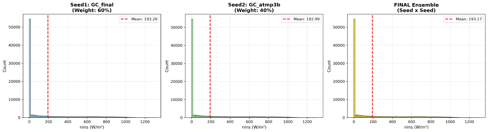
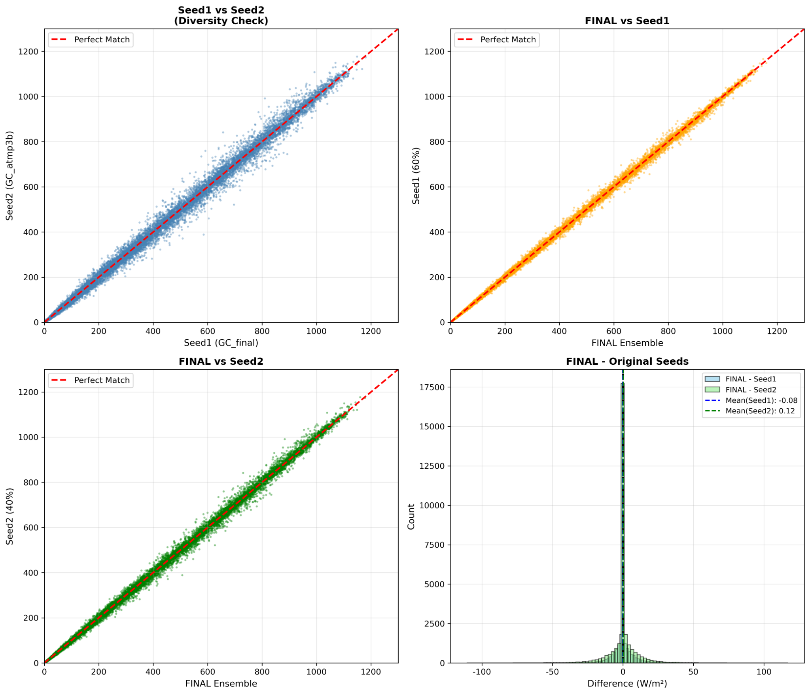
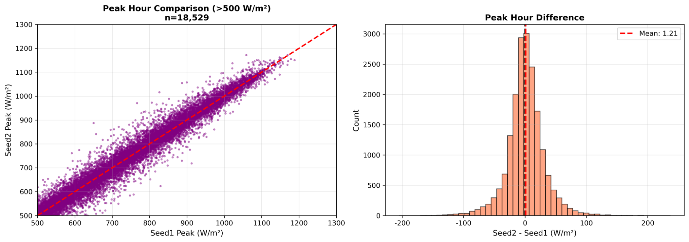

# POSTECH OIBC Solar

**Environmental sensor data + solar geometry + LightGBM for solar irradiance estimation**

리조트/발전소 환경 센서 데이터와 위치·시간 정보를 활용해 **일사량(`nins`, W/m²)** 을 예측한 POSTECH OIBC Solar 프로젝트입니다.

## Result

| Metric | Score |
|:---:|---:|
| **MAE** | **45.77** |

### Final Ensemble

```text
GC_final      60%
GC_atmp3b     40%
        ↓
FINAL Ensemble
```

```math
\hat{y}_{\mathrm{final}} = 0.60\hat{y}_{\mathrm{GC\_final}} + 0.40\hat{y}_{\mathrm{GC\_atmp3b}}
```

두 모델은 전체적으로 높은 상관을 보이지만, 고일사량 구간과 일부 기상 조건에서 예측 편차가 발생합니다.  
최종 제출에서는 이를 활용해 `GC_final`을 중심 모델로 두고 `GC_atmp3b`를 40% 결합했습니다.

---

## Problem

환경센서가 설치된 발전소의 시계열/기상/위치 정보를 이용하여 **일사량(`nins`)** 을 예측하는 회귀 문제입니다.

주요 입력 변수:

| Category | Examples |
|---|---|
| Time | `time` |
| Plant | `pv_id` |
| Temperature | `temp_a`, `temp_b`, `temp_max`, `temp_min`, `appr_temp` |
| Cloud / Humidity | `cloud_a`, `cloud_b`, `humidity`, `rel_hum` |
| Wind | `wind_spd_a`, `wind_spd_b`, `wind_dir_a`, `wind_dir_b` |
| Weather | `rain`, `snow`, `precip_1h`, `pressure`, `ground_press` |
| Solar proxy | `uv_idx` |
| Location | `coord1`, `coord2` |
| Target | `nins` (W/m²) |

> Competition data is not included in this repository.

---

## Approach

### 1. Time & Cyclic Features

시간에 따른 태양 위치와 계절성을 모델이 학습할 수 있도록 시간 파생 변수를 구성했습니다.

- hour / minute / month / day-of-year / day-of-week
- `sin/cos` cyclic encoding
- daytime indicator
- time × cloud / temperature / UV interactions

### 2. Geographic Feature Engineering

발전소 위치 좌표를 그대로 사용하는 것에 더해 발전소 간 지리적 구조를 피처화했습니다.

- coordinate normalization
- distance / angle / interaction features
- **KMeans location clustering (`k=10`)**
- distance to cluster center
- cluster-level high-quantile solar potential

### 3. Solar Geometry

단순 시간 피처만으로는 일사량의 물리적 구조를 충분히 표현하기 어렵기 때문에 태양 기하 기반 변수를 추가했습니다.

- solar elevation / zenith
- solar declination
- clock / true solar hour angle
- day length
- normalized hour angle
- midday shape

### 4. Physics-inspired Features

기상 변수와 태양 위치를 결합해 물리적 의미를 갖는 proxy를 생성했습니다.

- air mass
- Haurwitz clear-sky GHI
- extraterrestrial irradiance (`I0`, `I0h`)
- atmospheric transmittance
- Rayleigh / water-vapor / aerosol transmittance proxy
- clear-sky / cloud mismatch
- clearness / anisotropy proxy

### 5. LightGBM Tweedie Regression

`GC_atmp3b` 모델은 비음수이며 긴 꼬리를 갖는 일사량 분포를 고려해 **Tweedie objective**를 사용했습니다.

| Parameter | Value |
|---|---:|
| Objective | Tweedie |
| Tweedie power | 1.05 |
| Trees | 20,000 |
| Learning rate | 0.03 |
| Num leaves | 511 |
| Location clusters | 10 |
| Seeds | 17, 42, 77 |
| Early stopping | 500 |

### 6. Group-based Validation

동일 발전소가 train/validation에 동시에 포함되어 성능이 과대평가되는 것을 줄이기 위해 `pv_id` 단위 GroupSplit을 사용했습니다.

```text
Train PV IDs : 146
Valid PV IDs : 37
Overlap      : 0
```

`GC_atmp3b` 3-seed ensemble의 해당 holdout MAE는 약 **34.05**였습니다. 실제 competition MAE는 상단의 **45.77**입니다.

### 7. Post-processing

모델 출력에 물리적으로 타당한 제약을 적용했습니다.

- night-time irradiance → `0`
- daytime rolling smoothing
- negative prediction clipping
- tiny prediction → `0`

---

## Model Analysis

### Prediction Distribution



두 seed 모델과 최종 ensemble의 평균 일사량은 매우 유사하며, 0 부근의 높은 빈도와 긴 우측 꼬리를 유지합니다.

### Model Diversity



`GC_final`과 `GC_atmp3b`는 대체로 1:1 선을 따라가지만 일부 구간에서 차이를 보입니다. 최종 예측은 60:40 가중 평균이므로 `GC_final`에 더 가깝게 위치합니다.

### Peak-hour Analysis



고일사량 구간(`>500 W/m²`)에서는 두 모델 간 분산이 더 커지며, 이 차이가 단일 모델 대신 ensemble을 사용한 이유 중 하나입니다.

---

## Repository Structure

```text
postech-oibc-solar/
├── README.md
├── requirements.txt
├── .gitignore
├── assets/
│   ├── distribution_comparison.png
│   ├── scatter_analysis.png
│   └── peak_analysis.png
└── src/
    ├── train_gc_atmp3b.py
    └── ensemble.py
```

---

## Installation

Python 3.10+ recommended.

```bash
python -m venv .venv
```

Windows:

```bash
.venv\Scripts\activate
pip install -r requirements.txt
```

Linux / macOS:

```bash
source .venv/bin/activate
pip install -r requirements.txt
```

---

## Data Structure

Place the competition files under `data/`.

```text
data/
├── train.csv
├── test.csv
└── submission_sample.csv
```

The raw data is intentionally excluded from Git.

---

## Run

### GC_atmp3b

```bash
python src/train_gc_atmp3b.py \
  --data-dir ./data \
  --output ./outputs/gc_atmp3b_submission.csv
```

Windows CMD:

```cmd
python src\train_gc_atmp3b.py --data-dir .\data --output .\outputs\gc_atmp3b_submission.csv
```

### Final 60:40 Ensemble

If `GC_final` and `GC_atmp3b` submission files are available:

```bash
python src/ensemble.py \
  --gc-final ./outputs/gc_final.csv \
  --gc-atmp3b ./outputs/gc_atmp3b_submission.csv \
  --output ./outputs/final_ensemble.csv
```

---

## Key Takeaways

- 기상 관측값만 사용하는 것보다 **시간·위치·태양 기하 구조를 직접 피처화**하는 것이 핵심이었습니다.
- 발전소별 위치 차이를 KMeans cluster와 solar-potential 피처로 표현했습니다.
- 단일 seed보다 3-seed 평균으로 모델 변동성을 완화했습니다.
- 야간 0 강제 및 daytime smoothing을 통해 태양광 도메인의 물리적 제약을 반영했습니다.
- 마지막 단계에서는 서로 다른 두 파이프라인을 **60:40 weighted ensemble**로 결합했습니다.

---

## Notes

- `energy`는 train에만 존재하고 test에는 존재하지 않아 학습 피처에서 제외합니다.
- 원본 대회 데이터는 저장소에 포함하지 않습니다.
- 결과는 실행 환경, LightGBM 버전 및 데이터 전처리 상태에 따라 달라질 수 있습니다.
